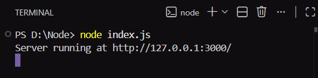

# 🌐 Node.js HTTP Server – Hello World

## 📌 Overview
This repository contains a **basic Node.js HTTP server** built using Node’s **core `http` module**, without any external frameworks. It is designed as a foundational backend exercise to understand how Node.js handles HTTP requests and responses at a low level and clearly distinguishes between server-side execution and client-side output.

## 🎯 Objectives
- Build a simple HTTP server using Node.js core modules  
- Understand the request–response lifecycle  
- Learn the role of HTTP status codes and headers  
- Differentiate console output from browser output  
- Prepare for backend frameworks such as Express  

## 🛠️ Technologies Used
- **Node.js**
- **JavaScript (CommonJS)**
- **Core `http` module**

## ⚙️ How the Application Works
The server is created using `http.createServer()` and listens for incoming HTTP requests. When the server starts, it logs a message in the terminal. When accessed through a browser, it responds with a plain text message. This setup intentionally avoids frameworks to focus on core backend concepts.

## 🖥️ Output

### 1️⃣ Console Output (Server-side)

The following screenshot shows the terminal output after starting the server:

### 2️⃣ Browser Output (Client-side)

The following screenshot shows the response displayed in the browser:

✔️ The project produces **exactly two outputs**:
- One **console output** (server-side)
- One **browser output** (client-side)

## 📦 package.json Explanation
- `name` → Project name  
- `version` → Initial version  
- `main` → Entry point file  
- `type: commonjs` → Enables `require()` syntax  
- No dependencies → Uses only Node.js core modules  

## 🧠 Key Learnings
- Node.js can create an HTTP server without frameworks  
- Console output and browser output are not the same  
- HTTP headers and status codes control responses  
- Backend logic runs independently of the client  

## 👨‍💻 Author
**Shreya Awari**  
📧 Email: shreyaawari31@gmail.com  
🌐 GitHub: https://github.com/shreyaawari28  

⭐ Star this repository if it helped you understand the fundamentals of Node.js HTTP servers.

